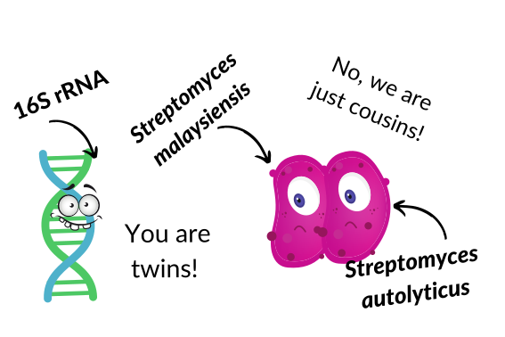
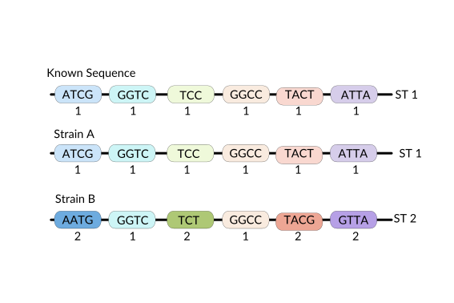

  

## **Overview**
Welecome to MLST_MicroSoc_2022 repository and thank you for expressing your interest in our research! :wave: :microscope: :relaxed: :woman_technologist: 

This is the repository where you can find supplementary data for poster presented at the Microbiology Society Annual Conference 2022. 

***

## **Introduction**
### **Why are *Streptomyces* important?**

The global crisis of antibiotic resistance (AMR) contributes to over 700,000 deaths annually. If left unchecked, AMR will become the leading global cause of death by 2050, killing over 10 million people. A recent discovery showed that *Streptomyces sp.* SM01 possesses the ability to produce a novel antibiotic picolinamycin with antimicrobial activity against drug-resistant bacterial strains. Additionally, members of the genus *Streptomyces* are prolific producers of a variety important bioactive compounds, accounting for the synthesis of over 80% of all clinically approved bioactive compounds. Interest in *Streptomyces* species significantly increased after discovering their production of the antimicrobial compound streptomycin, and chemotherapy medication actinomycin. Over 650 species in the family of *Streptomycetaceae* have been identified. These are potential reservoirs of novel drugs. Genes involved in synthesis of bioactive compounds can be mined from these bacterial genomes and, as the number of sequenced *Streptomyces* genomes increased in the past decade, this has had a significant beneficial impact on drug discovery. 

A powerful way to discover pharmaceutically-important compounds is to find and identify genes responsible for their synthesis by comparing complete genome sequences of various species. In addition, this approach helps avoid “rediscovery” of known compounds and prioritises compounds with potential novel clinical activity for extensive laboratory work from closely related genomic sequences. However, the exact relationships between *Streptomyces* species are currently poorly defined, and many species are incorrectly named.
 

### **Multilocus Sequence Typing**
Multilocus sequence typing (MLST) is widely used to characterise bacterial species based on allelic differences in a small set of genes. As shown below, unique allele numbers are assigned to each observed variant of one of the genes in the MLST profile to measure DNA sequence variations. When the sequence is different, a new allele number is assigned. The assigned allele numbers are combined into an allelic profile that is used to characterise strains and assign sequence type (ST). 

  

The current canonical *Streptomyces* Multilocus Sequence Typing Scheme provided by  comprises six markers (16S rRNA, atpD, gyrB, recA, rpoB and trpB) and 236 sequence types (STs; only two new STs were reported since 2016). 
 
 
With the recent increase in sequenced Streptomyces we wanted to answer the following questions: 
- How do STs map onto *Streptomyces* taxonomy determined from genome sequences?
- What does this tell us about the taxonomic structure of *Streptomyces*?

## **Methods**
- All 2276 available *Streptomyces* genome sequences were downloaded from [NCBI](https://www.ncbi.nlm.nih.gov) on the 8th of July 2021.
- 673 16S rRNA, 813 atpD, 576 gyrB, 890 recA, 873 rpoB and 784 trpB new allele variants were identified with [MLST tool](https://github.com/tseemann/mlst). 
- *Streptomyces* taxon boundies were assessed with [pyANI](https://github.com/widdowquinn/pyani) (%ID >≈95%, %coverage >≈50%). 

***
## **Results**
### **Interactive representations of minimum spanning trees**
All interactive graphs represent minimum spanning trees with 852 sequence types and 292 connected components describing all sequences *Streptomyces* genomes, and all sequence types from the pubMLST database. Each node represents a unique sequence type, and each edge corresponds to traversing from one sequence type to other by making up to five marker changes. This divison of *Streptomyces* into 292 components that share no marker alleles with each other implies a set of natural divisions between groups of isolates. 

- #### **pubMLST vs new *Streptomyces* sequence types**
The current canonical *Streptomyces* Multilocus Sequence Typing Scheme provided by [pubMLST](https://pubmlst.org) comprises six markers (16S rRNA, atpD, gyrB, recA, rpoB and trpB) and 236 sequence types. We extended the current scheme to include all avaliable *Streptomyces* genomes, identifying over 600 novel sequence types. 

<iframe src="docs/MLSTIG_00003.html"
    sandbox="allow-same-origin allow-scripts"
    width="100%"
    height="100%"
    scrolling="yes"
    seamless="seamless"
    frameborder="0">
</iframe>

To view how they map onto minimum spanning tree simply click [here](docs/MLSTIG_00003.html)!

- #### **Streptomyces** sequence type representation in GenBank
Despite all 2276 avaliable *Streptomyces* genome sequences were downloaded from [NCBI](https://www.ncbi.nlm.nih.gov), 150 pubMLST sequences types were without a representative genome. You can check out how they are represented throughout our minimum spanning tree [here](docs/MLSTIG_00002.html)!

- #### **Unique genera according to pyANI analysis within each connected component**
Using [pyANI](https://github.com/widdowquinn/pyani) we can determine whether genomes belong to the same candidate species or genus(%ID >≈95%, %coverage >≈50%), and examine their distributions on the minimum spanning tree that you can view [here](docs/MLSTIG_0005.html). Here we present that organisms assigned the same species name in [NCBI](https://www.ncbi.nlm.nih.gov):

1. May share <95% genome identity suggesting that the should be distinct species. 
2. Some genomes identified as the same species (>≈95% genome identity) with [pyANI](https://github.com/widdowquinn/pyani) are found in diconnected minimum spanning tree components. 

(pyANI [genome identity plot](docs/matrix_identity_rimosus.pdf) and [aligment coverage](docs/matrix_coverage_rimosus.pdf))
3. A single connected component unites two sets of genomes that belong to a distinct candidate genera as less than 50% of their genomes are homologous, by alignment length. 

(pyANI [genome identity plot](docs/matrix_identity_15_1.pdf) and [aligment coverage](docs/matrix_coverage_15_1.pdf))

***
If you have any questions please do not hesitate to contact me at <angelika.kiepas@strath.ac.uk>:envelope_with_arrow: :woman_technologist:. 
